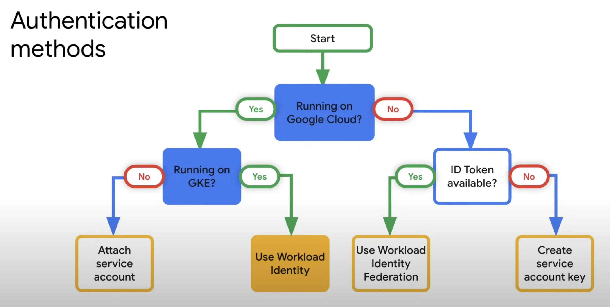

- [gcloud Commands](#gcloud-commands)
  * [Basics](#basics)
  * [Kubernetes](#kubernetes)
  * [Compute](#compute)
  * [CI/CD Builds](#cicd-builds)
  * [DNS](#dns)
  * [Pub/Sub](#pubsub)
  * [IAM](#iam)
- [gsutil commands](#gsutil-commands)
  * [Bucket](#bucket)
- [Concepts](#concepts-1)
  * [Service account](#service-account)
  * [Authentication on GCP](#authentication-on-gcp)
  * [Logging](#logging)
  * [Monitoring](#monitoring)
  * [Cloud Trace](#cloud-trace)
  * [Pub/Sub](#pubsub-1)
- [Tools](#tools)
____


## gcloud Commands

### Basics

##### To check command installation

```sh
gcloud info
```

##### To login

```sh
gcloud auth login
```

##### To list existing logins

```sh
gcloud auth list
```

##### To echo out JWT token of the current login

```sh
gcloud auth print-identity-token
```

##### To list current configuration

```sh
gcloud config list
```

##### To set default zone

```sh
gcloud config set compute/zone asia-east1-b
```

##### To change project

```sh
gcloud config set core/project $PROJECT_ID
```

##### To get project number from project ID

```sh
gcloud projects list --filter="project_id:$PROJECT_ID" --format='value(project_number)'
```

##### To get project ID from project number

```sh
gcloud projects list --filter="project_id:$PROJECT_NUMBER" --format='value(project_id)'
```

### Kubernetes

##### To create a kubernetes cluster

```sh
gcloud container clusters create $CLUSTER_NAME -m n1-standard-2 --num-nodes=3
```

##### To enable network policy (Calico)

```sh
gcloud container clusters update $CLUSTER_NAME --update-addons=NetworkPolicy=ENABLED
gcloud container clusters update $CLUSTER_NAME --enable-network-policy
```

##### To enable workload identity

```sh
gcloud container clusters update $CLUSTER_NAME --workload-pool=$PROJECT_ID.svc.id.goog
gcloud container node-pools update $POOL_NAME --cluster $CLUSTER_NAME --workload-metadata=GKE_METADATA
```

Note that this change will prevent workloads from using the Compute Engine
service account and must be carefully rolled out.

See [Link Kubernetes service account to Google service account](./#link-kubernetes-service-account-to-google-service-account).

##### To set credentials on local machine to access kubernetes clusters

```sh
gcloud container clusters get-credentials $CLUSTER_NAME
```

##### To authenticate to Container Registry on GCP

```sh
gcloud auth configure-docker
```

Note that it can be executed on a GCP compute instance as well

##### To show cluster information

```sh
gcloud container clusters describe $CLUSTER_NAME
```

##### To list clusters

```sh
gcloud container clusters list
```

or, to restrict to a zone

```sh
gcloud container clusters list --zone asia-east1-b
```

##### To delete a container cluster

```sh
gcloud container clusters delete any-project-name-cluster
```

##### To change the number of nodes in a cluster

```sh
gcloud container clusters resize $CLUSTER_NAME --size=1
```

##### To migrate workloads to a different machine type

```sh
gcloud container node-pools create new-pool-name \
  --cluster $CLUSTER_NAME \
  --machine-type=f1-micro \
  --num-nodes=10

for node in $(kubectl get nodes -l cloud.google.com/gke-nodepool=default-pool -o=name); do kubectl cordon "$node"; done

for node in $(kubectl get nodes -l cloud.google.com/gke-nodepool=default-pool -o=name); do kubectl drain --force --ignore-daemonsets "$node"; done

gcloud container node-pools delete default-pool --cluster $CLUSTER_NAME
```

A kubernetes service can be exposed externally by assigning it as type `LoadBalancer` (see [Connect a Front End to a Back End Using a Service](https://kubernetes.io/docs/tasks/access-application-cluster/connecting-frontend-backend/))

##### To tag and push images onto Google Container Registry

```sh
docker tag image-name:latest asia.gcr.io/project-name/image-name
gcloud docker push asia.gcr.io/project-name/image-name
```

##### To allow pulling docker images from another project

Suppose the image in docker registry of `your-project-a` is used in cluster of
`your-project-b`,

```sh
gcloud config set core/project your-project-b
SVC_EMAIL=$(gcloud iam service-accounts list --filter="Compute Engine default service account" --format=json | jq -r '.[] | .email')
gcloud projects add-iam-policy-binding your-project-a --member=serviceAccount:${SVC_EMAIL} --role roles/storage.objectViewer
```

##### To create roles for Helm 2

```sh
kubectl --user=admin/$CLUSTER_NAME create clusterrolebinding cluster-admin-binding --clusterrole cluster-admin --user $(gc config get-value account)
kubectl create serviceaccount --namespace=kube-system tiller
kubectl create clusterrolebinding tiller-clusterrolebinding --clusterrole=cluster-admin --serviceaccount=kube-system:tiller
helm init --service-account tiller --wait
```

##### To create a public IP address and assign it to a cluster running Ingress using Nginx

Assuming the region of the cluster is `asia-east1`,

```sh
gcloud compute addresses create my-cluster-ip --region asia-east1
IPADDR=$(gcloud compute addresses describe my-cluster-ip --region asia-east1 --format json | jq -r .address)
helm install nginx-ingress --namespace default stable/nginx-ingress --set controller.service.loadBalancerIP=$IPADDR
```

##### Link Kubernetes service account to Google service account

Note that [workload identity has to be enabled](./#to-enable-workload-identity)
before accounts can be linked.

```sh
gcloud iam service-accounts add-iam-policy-binding --role roles/iam.workloadIdentityUser --member "serviceAccount:$PROJECT_ID.svc.id.goog[$NAMESPACE/$SERVICE_ACCOUNT]" $GOOGLE_SERVICE_ACCOUNT@$PROJECT_ID.iam.gserviceaccount.com
```

To the Kubernetes service account to bind to, add the following annotation

```yaml
iam.gke.io/gcp-service-account=your_google_service_accont_name@your_project_id.iam.gserviceaccount.com
```

To create a secret and allow a Google service account to access it,

```sh
gcloud secrets create $SECRET_NAME --replication-policy=automatic --data-file=$SECRET_FILE
gcloud secrets add-iam-policy-binding $SECRET_NAME --member=serviceAccount:$GOOGLE_SERVICE_ACCOUNT@$PROJECT_ID.iam.gserviceaccount.com --role=roles/secretmanager.secretAccessor
```

To synchronise a secret from GCP Secret Manager to file system of a container,

```yaml
apiVersion: secrets-store.csi.x-k8s.io/v1alpha1
kind: SecretProviderClass
metadata:
  name: your-app-secrets
spec:
  provider: gcp
  parameters:
    secrets: |
      - resourceName: "projects/$PROJECT_ID/secrets/testsecret/versions/latest"
        fileName: "secret.txt"
```

```yaml
apiVersion: v1
kind: ServiceAccount
metadata:
  name: $SERVICE_ACCOUNT
  namespace: $NAMESPACE
  annotations:
    iam.gke.io/gcp-service-account: $GOOGLE_SERVICE_ACCOUNT@$PROJECT_ID.iam.gserviceaccount.com
---
apiVersion: v1
kind: Pod
metadata:
  name: mypod
  namespace: default
spec:
  serviceAccountName: $SERVICE_ACCOUNT
  containers:
  - image: your-image:latest
    name: mypod
    volumeMounts:
      - mountPath: "/var/secrets"
        name: mysecret
  volumes:
  - name: mysecret
    csi:
      driver: secrets-store.csi.k8s.io
      readOnly: true
      volumeAttributes:
        secretProviderClass: your-app-secrets
```

##### Unlink Kubernetes service account to Google service account

```sh
gcloud iam service-accounts remove-iam-policy-binding \
  --role roles/iam.workloadIdentityUser \
  --member "serviceAccount:$PROJECT_ID.svc.id.goog[$NAMESPACE/$SERVICE_ACCOUNT]" \
  $GOOGLE_SERVICE_ACCOUNT@$PROJECT_ID.iam.gserviceaccount.com
```

### Compute

##### To create an instance

```sh
gcloud compute instances create $INSTANCE_ID --machine-type f1-micro
```

or, with a specific VM image

```sh
gcloud compute instances create $INSTANCE_ID --image-family debian-8 --machine-type f1-micro
```

##### To configure firewall for HTTP and HTTPS traffic

```sh
gcloud compute firewall-rules create instance-rule --allow tcp:80,tcp:443
```

##### To list firewall rules

```sh
gcloud compute firewall-rules list
```

This effectively shows the IP addresses associated with a load balancer

##### To list backend services

```sh
gcloud compute backend-services list
```

This effectively shows the backend services associated with a load balancer

##### SSH

```sh
gcloud compute ssh $USERNAME@$INSTANCE_ID
```

##### Manage SSH keys

The SSH keys setup in `gcloud comnpute ssh` are store at project level and it
can be listed by

```sh
gcloud compute project-info describe --format json | jq -r '.commonInstanceMetadata.items[] | select(.key=="ssh-keys") | .value'
```

To add/remove keys, dump the keys to a file by

```sh
gcloud compute project-info describe --format json | jq -r '.commonInstanceMetadata.items[] | select(.key=="ssh-keys") | .value' > /tmp/gcloud_ssh_keys
```

Edit `/tmp/gcloud_ssh_keys`.

Update project setting with the file by

```sh
gcloud compute project-info add-metadata --metadata-from-file=ssh-keys=/tmp/gcloud_ssh_keys
```

##### SCP

```sh
gcloud compute scp some.txt $INSTANCE_ID:/path/to/the/file
```

or, to copy recursively

```sh
gcloud compute scp some-directory video2:/path/to/a/directory/ --recurse
```

##### To create a persistent volume

```sh
gcloud compute disks create --size 1GB $DISK_NAME
```

##### To list disk provisioned

```sh
gcloud compute disks list
```

##### To delete a disk

```sh
gcloud compute disks delete $DISK_NAME
```

##### To describe a disk

```sh
gcloud compute disks describe $DISK_NAME
```

##### To attach a persistent disk to an instance ([reference](https://cloud.google.com/compute/docs/disks/add-persistent-disk#formatting))

```sh
gcloud compute instances attach-disk $INSTANCE_ID --disk $DISK_NAME
```

On the instance,

```sh
sudo mkfs.ext4 -m 0 -F -E lazy_itable_init=0,lazy_journal_init=0,discard /dev/sdb
mkdir my-mount
sudo mount -o discard,defaults /dev/sdb ./my-mount
sudo chmod a+w ./my-mount
sudo chown alex.alex ./my-mount
```

##### To create a custom image from a disk

```sh
gcloud compute images create your_image_name --source-disk=$DISK_NAME --family=debian-10 --storage-location=$ZONE_NAME
```

##### To list instances

```sh
gcloud compute instances list
```

##### To describe an instance

```sh
gcloud compute instances describe $INSTANCE_ID
```

or, to list service accounts and scopes

```sh
gcloud compute instances describe $INSTANCE_ID --format='yaml(serviceAccounts[].scopes[])'
```

##### To delete an instance

```sh
gcloud compute instances delete $INSTANCE_ID
```

##### To upload a directory onto an instance

```sh
gcloud compute scp ./my-source $INSTANCE_ID:/home/user/my-source --recurse
```

##### To list available machine types (see also [Machine Types](https://cloud.google.com/compute/docs/machine-types))

```sh
gcloud compute machine-types list
```

##### To list available disk-types

```sh
gcloud compute disk-types list
```

##### To list available VM images

```sh
gcloud compute images list
```

### CI/CD Builds

##### To list recent builds

```sh
gcloud builds list --limit 10
```

#### To list logs of a build

```sh
gcloud builds log $BUILD_ID
```

or to stream a on-going build,

```sh
gcloud builds log --stream $BUILD_ID
```

### DNS

##### To list managed zones

```sh
gcloud dns managed-zones list
```

##### To add a managed zone

```sh
gcloud dns managed-zones create test-com --dns-name test.com --description ""
```

##### To describe a zone

```sh
gcloud dns managed-zones describe $ZONE_ID
```

##### To list all records of a domain

```sh
gcloud dns record-sets list --zone=test-com
```

##### To add a record

```sh
gcloud dns record-sets transaction start --zone=test-com
gcloud dns record-sets transaction add --zone=test-com --ttl 3600 --type A --name office.alexho.dev "192.168.1.1"
gcloud dns record-sets transaction add --zone sbcchk-com --ttl 300 --type MX --name test.com "10 mx1.emailsrvr.com." "20 mx2.emailsrvr.com."
gcloud dns record-sets transaction execute --zone=test-com
```

To abort a transaction

```sh
gcloud dns record-sets transaction abort --zone=test-com
```

### Pub/Sub

##### Concepts

- [Handle message
  failures](https://cloud.google.com/pubsub/docs/handling-failures) - including
  dead-letter topic

##### To list topics

```sh
gcloud pubsub topics list
```

##### To list subscriptions

```sh
gcloud pubsub subscriptions list
```

### IAM

##### Links

- [Permission Reference](https://cloud.google.com/iam/docs/permissions-reference)
- [Pre-defined roles](https://cloud.google.com/iam/docs/understanding-roles)

##### To list all service accounts

```sh
gcloud iam service-accounts list
```

##### To create service account

```sh
gcloud iam service-accounts create --display-name=$GOOGLE_SERVICE_ACCOUNT $GOOGLE_SERVICE_ACCOUNT
```

##### To list keys of a service account

```sh
gcloud iam service-accounts keys list --iam-account=$GOOGLE_SERVICE_ACCOUNT@$PROJECT_ID.iam.gserviceaccount.com
```

##### To create key of service account

To get key in form of `json`

```sh
gcloud iam service-accounts keys create --iam-account=$GOOGLE_SERVICE_ACCOUNT@$PROJECT_ID.iam.gserviceaccount.com key.json
```

To get key in form of `p12`

```sh
gcloud iam service-accounts keys create --key-file-type=p12 --iam-account=$GOOGLE_SERVICE_ACCOUNT@$PROJECT_ID.iam.gserviceaccount.com key.p12
```

##### To list roles

```sh
gcloud iam roles list
```

##### To list permissions of a role

```sh
gcloud iam roles describe --format json roles/container.admin | jq -r '.includedPermissions[]'
```

##### To list role bindings of a project

```sh
gcloud projects get-iam-policy $PROJECT_ID
```

##### To list organizations

```sh
gcloud organizations list
```

##### To list role bindings of an organization

```sh
gcloud organization get-iam-policy your-organization-name
```

## gsutil commands

### Bucket

##### To copy files recursively

```sh
gsutil cp -R path/to/a/directory gs://$BUCKET_NAME
```

or, with multithreads,

```sh
gsutil -m cp -R path/to/a/directory gs://$BUCKET_NAME
```

##### To create a bucket

```sh
gsutil mb -l asia-east1 -c coldline gs://$BUCKET_NAME
```

##### To serve a website from a bucket directly

Create a `CNAME` DNS record and points it to `c.storage.googleapis.com`.
Noie that it serves traffic in HTTP only (instead of HTTPS).

##### To list IAM member-role bindings

```sh
gsutil iam get gs://$BUCKET_NAME
```

##### To create a notification on Pub/Sub

```sh
gcloud storage service-agent --project=$PROJECT_ID
```

If any service agent is created, you can check the email address by `gcloud
storage service-agent`

## Concepts

### Service account

- best practices
  * follow a naming and documentation convention
  * create single purpose service accounts
  * rotate service account keys often
  * disable un-used service accounts
  * before deleting service accounts, disable them

### Authentication on GCP



### Logging

- [Logging query
  language](https://cloud.google.com/logging/docs/view/logging-query-language)
  - case-insensitive, with the exception of regular expressions
  - JSON null value are expressed as `NULL_VALUE`
  - `a OR NOT b AND NOT c OR d` is equivalent to
    `(a OR (NOT b)) AND ((NOT c) OR d)`
  - `a=b AND c=d AND NOT e=f` is equivalent to
    `a=b c=d -e=f`
  - `AND`, `OR` and `NOT` can be used by all filters
  - `AND` and `NOT` can be used by filters in a log view
  - to combine AND and OR rules in the same expression, you must nest the rules
    using parentheses
  - boolean operators always need to be capitalized
    * Lowercase `and`, `or`, and `not` are parsed as search terms
  - operators
    - `=`           -- equal
    - `!=`          -- not equal
    - `> < >= <=`   -- numeric ordering
    - `:`           -- "has" matches any substring in the log entry field
    - `=~`          -- regular expression search for a pattern
    - `!~`          -- regular expression search not for a pattern
- [View logs by using the Logs
  Explorer](https://cloud.google.com/logging/docs/view/logs-explorer-interface)
- [Quota and limits](https://cloud.google.com/logging/quotas)

### Monitoring

- metrics
  * alignment period
    + it is a look-back interval from a particular point in time; the aligner is
      the function that combines the points into the look-back interval into an
      aligned value.
      + example
        + when the alignment period is five minutes, at 1:00 PM, the alignment
          period contains the samples received between 12:55 PM and 1:00 PM. At
          1:01 PM, the alignment period slides one minute and contains the
          samples received between 12:56 PM and 1:01 PM.
  * duration (or duration window)
    + it is used to prevent a condition from triggering due to a single
      measurement or forecast
    + metric-threshold conditions
      + trigger when, for a single time series, every aligned measurement in
        a duration window (say 15 minutes) violates the threshold
    + metric-absence conditions
      + trigger when no data arrives for a time series in a duration window (say
        15 minutes)
    + forecast conditions
      + trigger when every forecast produced during a duration window (say 15
        minutes) predicts that the time series will violate the threshold within
        the forecast window

### Cloud Trace

- a distributed tracing system for Google Cloud
- it collects latency data from App Engine, HTTP(S) load balancers, and
  applications instrumented with the Cloud Trace API
- it shows application's dependencies
- it is not [Cloud Porfiler](https://cloud.google.com/profiler/docs)
- it only supports Linux
- it consists of a tracing client, which collects traces and sends them to your
  Google Cloud project
- using OpenTelemetry is easier and it implements batching which might improve
  performance
- it is a VPC Service Controls supported service
- a trace describes the time it takes an application to complete a single
  operation.
  - each trace consists of one or more spans
    * a span describes how long it takes to perform a complete sub-operation
- cost is based on number of traces involved

### Pub/Sub

- publisher
  * the maximum size of a `base64`-decoded message is 10Mb
  * message cannot be empty and must be a valid JSON object with at least one
    attribute (property)
  * batching of publishing message should be turn off (or batch number = 1) in
    most of the use cases (except streaming)
    + this is particularly important when ordering key is used
  * ordering is only guaranteed in region level
    + no global endpoint should be used
  * messages of a topic with no subscription will be discarded
  * messages expired after the retention period will be discarded and no dead
    letter will be generated
- subscriber
  * consumer of subscriber message needs to handle idempotency and duplication
    as publisher is not guaranteed to deliver the same message only once
  * subscription can be expired after 31 days (default) of inactivity and it can
    be configured to never expire
  * push subscriber requires a public DNS name and a non-self-signed SSL
    certificate (effectively `https`)
  * consumer of a pull subscriber can configure acknowledgement period
  * a push subscribe automatically controls the rate of push according the
    responses it received from previous pushes
    + it starts with push one message and, if it succeed, it pushes double the
      amount in the next push; the amount continue to increase until it gets
      feedback of error code from the other end
  * by default, client libraries default to use streaming pull (asynchronous)
    + in case capability of the client is low, synchronous pull should be used
      to control number of messages to be processed to prevent over-delivery
    + it is advised to configure maximum outstanding messages to avoid one
      consumer being overloaded and the other being idle
  * if a push subscriber is a Cloud Function, configuring IAM would be enough
    for authentication
- seek
  * future time
    + all messages before the seek time will be considered as acknowledged
  * past time
    + effectively replaying previously acknowledged messages
    + options
      + to a snapshot
        + states of acknowledgement remains as at the time the snapshot is made
        + it respects retention setting
        + allow replaying un-acknowledged message at the time the snapshot is
          made
        + a snapshot should be take before a deployment of new code
      + to a specific time
        + all messages before the seek time will be considered as acknowledged
        + more expensive than snapshot
- retention
  - topic level
    - maximum at 31 days
    - it is done regardless of a message has been consumed or not
  - subscription level
    - maximum at 7 days
- Pub/Sub Lite
  - it is mostly for real-time event processing
  - it does not support push subscribers
  - it is not as "managed" as Pub/Sub
  - it is closer to the model of running Kafka

## Tools

- [gcpdiag](https://github.com/GoogleCloudPlatform/gcpdiag) a lint tool to find
  configuration issues on GCP
  * `gcpdiag lint project=your_project_id`
  * in case there is a problem with authentication, run `gcloud auth login
    --update-adc` to create application credentials and the tool will read from
    this default
