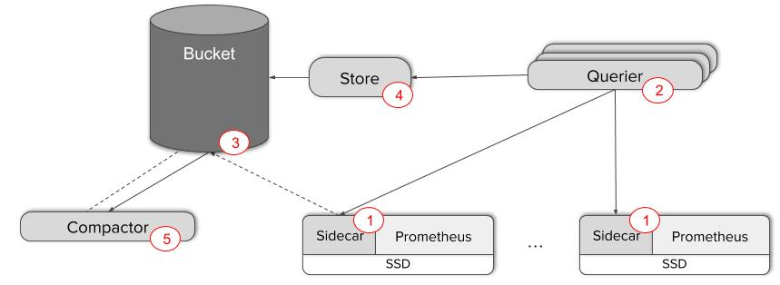

- [Links](#links)
- [Types of metrics](#types-of-metrics)
- [Abstractions of Metrics](#abstractions-of-metrics)
    + [Four Golden Signals](#four-golden-signals)
    + [USE Method](#use-method)
    + [RED Method](#red-method)
- [Metric sources](#metric-sources)
  * [Node Exporter](#node-exporter)
    + [Examples](#examples)
  * [cAdvisor](#cadvisor)
    + [Examples](#examples-1)
- [Other topics](#other-topics)
  * [PromQL](#promql)
    + [Tips](#tips)
  * [Alert Manager](#alert-manager)
  * [Grafana](#grafana)
  * [Kubernetes](#kubernetes)
  * [Operations](#operations)
    + [To deploy Prometheus Operator](#to-deploy-prometheus-operator)
  * [Tools](#tools)
    + [Installation](#installation)
    + [To check Prometheus file](#to-check-prometheus-file)
____
# Links

- [Reveal Your Deepest Kubernetes Metrics - Bob Cotton, Freshtracks.io](https://www.youtube.com/watch?v=1oJXMdVi0mM)

# Types of metrics

- `cAdvisor` - container metrics such as CPU, memory, memory and disk of a
  cluster exposed by kubetlet
- `node_exporter` - node metrics

# Abstractions of Metrics

### Four Golden Signals

This is originated from [Google SRE Handbook](https://landing.google.com/sre/books/).

- Latency — The time it takes to service a request
- Traffic — A measure of how much demand is being placed on your system
- Errors — The rate of requests that fail
- Saturation — How “full” your service is.

### USE Method

This focuses on resources (all physical server functional components (CPUs,
disks, buses, ...)).

- Utilisation: the average time that the resource was busy servicing work
- Saturation: the degree to which the resource has extra work which it cannot
  service, often queued
- Errors: the count of error events

### RED Method

This focuses on services.

- Rate: The number of requests per second.
- Errors: The number of those requests that are failing.
- Duration: The amount of time those requests take.

# Metric sources

## Node Exporter

- [Available metrics (via unit test of node-exporter)](https://github.com/prometheus/node_exporter/blob/master/collector/fixtures/e2e-output.txt)

Metric | Description
--- | ---
node_memory_MemTotal_bytes | the total amount of physical RAM (not including SWAP space)
node_memory_MemFree_bytes | the amount of physical RAM, in kilobytes, left unused by the system
node_memory_MemAvailable_bytes | An estimate of how much memory is available for starting new applications, without swapping. Calculated from MemFree, SReclaimable, the size of the file LRU lists, and the low watermarks in each zone. The estimate takes into account that the system needs some page cache to function well, and that not all reclaimable slab will be reclaimable, due to items being in use. The impact of those factors will vary from system to system.
node_vmstat_oom_kill | OOMKill count
node_cpu_seconds_total{mode="user"} | CPU time spent in userland
node_cpu_seconds_total{mode="system"} | CPU time spent in the kernel
node_cpu_seconds_total{mode="iowait"} | CPU time waiting for I/O
node_cpu_seconds_total{mode="idle"} | CPU time had nothing to do
node_cpu_seconds_total{mode="irq"} | CPU time servicing interrupts
node_cpu_seconds_total{mode="softirq"} | CPU time servicing soft interrupts
node_cpu_seconds_total{mode="guest"} | CPU time spent on running VMs (assuming the CPU in question itself is a host running VMs)
node_cpu_seconds_total{mode="steal"} | CPU time stole by other VMs (assuming the CPU in question itself is a VM)
node_load15 | 15-minute load average - number of processes to be processed in the last 15 minutes - it is best to divide this number by average number of CPUs available at the time

### Examples

Type | Statistic | PromQL
--- | --- | ---
N/A | Total number of CPUs in a cluster | count(node_cpu_seconds_total{mode="system"}) by (node)
N/A | Average number of CPUs in a node | count(node_cpu_seconds_total{mode="system"}) by (instance)
utilisation | CPU Core usage count | sum(rate(node_cpu_seconds_total{mode!="idle"}[5m])) BY (instance)
utilisation | CPU Core usage count without `iowait` | sum(rate(node_cpu_seconds_total{mode!="idle",mode!="iowait"}[5m])) BY (instance)
utilisation | % CPU utilisation | 1 - avg without (mode,cpu) (rate(node_cpu_seconds_total{mode="idle"}[5m]))
utilisation | % CPU utilisation | (1 - avg by (environment,instance) (irate(node_cpu_seconds_total{job="node-exporter",mode="idle"}[5m])))  * 100
utilisation | % CPU utilisation without `iowait` | (1 - avg by (environment,instance) (irate(node_cpu_seconds_total{job="node-exporter",mode="idle"}[5m])) - avg by (environment,instance) (irate(node_cpu_seconds_total{job="node-exporter",mode="iowait"}[5m]))) * 100
N/A | % CPU Idle | (avg by (environment,instance) (irate(node_cpu_seconds_total{job="node-exporter",mode="idle"}[5m])))  * 100
N/A | % CPU I/O wait | (avg by (environment,instance) (irate(node_cpu_seconds_total{job="node-exporter",mode="iowait"}[5m])))  * 100
N/A | % CPU System usage | (avg by (environment,instance) (irate(node_cpu_seconds_total{job="node-exporter",mode="system"}[5m])))  * 100
N/A | % CPU User usage | (avg by (environment,instance) (irate(node_cpu_seconds_total{job="node-exporter",mode="user"}[5m])))  * 100
N/A | % CPU Other usages | (avg by (environment,instance) (irate(node_cpu_seconds_total{job="node-exporter",mode=~"softirq\|nice\|irq\|steal"}[5m])))  * 100
N/A | 1-minute load | sum by (instance) (node_load1{job="node-exporter"})
N/A | 5-minute load | sum by (instance) (node_load5{job="node-exporter"})
N/A | 15-minute load | sum by (instance) (node_load15{job="node-exporter"})
saturation | CPU Saturation using 1-minute load | sum(node_load1) by (instance) / count(node_cpu_seconds_total{mode="system"}) by (instance) * 100
saturation | CPU Saturation using 5-minute load | sum(node_load5) by (instance) / count(node_cpu_seconds_total{mode="system"}) by (instance) * 100
saturation | CPU Saturation using 15-minute load | sum(node_load15) by (instance) / count(node_cpu_seconds_total{mode="system"}) by (instance) * 100
N/A | % Memory available | sum by (instance) ((node_memory_MemAvailable_bytes / node_memory_MemTotal_bytes) * 100)
N/A | % Memory available | sum by (instance) (((node_memory_MemFree_bytes + node_memory_Buffers_bytes + node_memory_Cached_bytes) / node_memory_MemTotal_bytes) * 100)
utilisation | % Memory utilisation | (1 - sum by (instance) (node_memory_MemAvailable_bytes / node_memory_MemTotal_bytes)) * 100
N/A | Data transmitted | rate(node_network_transmit_bytes_total{device!="lo"}[5m])
N/A | Data received | rate(node_network_receive_bytes_total{device!="lo"}[5m])
utilisation | Data Mb/s | (sum(rate(node_network_receive_bytes_total[5m])) by (instance) + sum(rate(node_network_transmit_bytes_total[5m])) by (instance)) / 1024 / 1024
saturation | Packet drop /s | sum(rate(node_network_receive_drop_total[5m])) by (instance) + sum(rate(node_network_transmit_drop_total[5m])) by (instance)
error | Network error rate | sum by (instance) (rate(node_network_receive_errs_total[5m])) + sum by (instance) (rate(node_network_transmit_errs_total[5m]))
N/A | Node total disk size (Gb) | sum (node_filesystem_size_bytes{job="node-exporter",fstype=~"ext4\|xfs", mountpoint="/"}) by (mountpoint, instance) /1024/1024/1024
N/A | Node available disk size (Gb) | sum (node_filesystem_avail_bytes{job="node-exporter",fstype=~"ext4\|xfs", mountpoint="/"}) by (mountpoint, instance) /1024/1024/1024
N/A | Node disk read speed (Mb/s) | (irate(node_disk_read_bytes_total{job="node-exporter"}[1m]))/1024/1024
N/A | Node disk write speed (Mb/s) | (irate(node_disk_written_bytes_total{job="node-exporter"}[1m]))/1024/1024
N/A | Node Inode available % | (1 -node_filesystem_files_free{job="node-exporter",fstype=\~"ext4\|xfs"} / node_filesystem_files{job="node-exporter",fstype=\~"ext4\|xfs"}) * 100

## cAdvisor

### Examples

Type | Statistic | PromQL
--- | --- | ---
utilisation | CPU Utilisation | sum(rate(container_cpu_usage_seconds_total[5m])) by (container_name)
saturation | CPU Saturation | sum(rate(container_cpu_cfs_throttled_seconds_total[5m])) by (container_name)
utilisation | Memory Utilisation | sum(container_memory_working_set_bytes{container_name!="", container_name!~"POD"}) by (container_name)
saturation | Memory Saturation | sum(container_memory_working_set_bytes) by (container_name) / sum(label_join(kube_pod_container_resource_limits_memory_bytes, "container_name", "", "container")) by (container_name)
utilisation | Data rate | sum(rate(container_network_receive_bytes_total[5m])) by (name) + sum(rate(container_network_transmit_bytes_total[5m])) by (name)
saturation | Packet drop /s | sum(rate(container_network_receive_packets_dropped_total[5m])) by (name) + sum(rate(container_network_transmit_packets_dropped_total[5m])) by (name)
error | Network error rate | sum by (name) (rate(container_network_receive_errors_total[5m])) + sum by (name) (rate(container_network_transmit_errors_total[5m]))
utilisation | Disk Utilisation | sum(rate(container_fs_writes_bytes_total[5m])) by (container_name,device) + sum(rate(container_fs_reads_bytes_total[5m])) by (container_name,device)

# Other topics

## PromQL

- [PromCon EU 2019: PromQL for Mere Mortals](https://www.youtube.com/watch?v=hTjHuoWxsks)
- [GitLab - Saturation
  Metrics](https://gitlab.com/gitlab-com/runbooks/blob/master/rules/service_saturation.yml)

### Tips

- always apply `rate` to counter metrics

## Alert Manager

- [PromCon EU 2019: Fun and Profit with Alertmanager](https://www.youtube.com/watch?v=VgsM8pOyN5s)
- [GitLab - Saturation
  Alerts](https://gitlab.com/gitlab-com/runbooks/blob/master/rules/general-service-alerts.yml)

## Grafana

- [PromCon EU 2019: Managing Grafana Dashboards with grafonnet and git](https://www.youtube.com/watch?v=kV3Ua6guynI)
- [GitLab - Capacity Planning Dashboard
  Alerts](https://gitlab.com/gitlab-com/runbooks/blob/master/dashboards/general/capacity-planning.jsonnet)

## Kubernetes

- if memory limits are implemented correctly, a node should never go into
  paging (or swap space). `node_exporter` metrics `node_vmstat_pgpgin` and
  `node_vmstat_pgpgin` can be used to indicate such activities.
- The “container” metrics that are exposed from `cAdvisor` are ultimately the
  metrics reported by the underlying Linux `cgroup` implementation.
- CPU limit and request are specified as fractions of a CPU or core (down to
  1/1000th) and those of memory is specified in bytes. If you set only limits,
  the request will be the same as the limit. Limits give you one knob to
  over-provision containers on a node as limits are not accounted for by the
  Kubernetes scheduler. That being said, if your container exceeds your limits
  the action depends on the resource; you will be throttled if you exceed the
  CPU limit, and killed if you exceed the memory limit.

## Operations

### To deploy Prometheus Operator

```sh
git clone https://github.com/coreos/kube-prometheus
cd kube-prometheus
```

There is a problem with release `0.3` (and probably since `0.2`) where
`nodeSelector` does not work. To workaround this problem, remove any
`nodeSelector` in all files in `/manifest` directory.

There is a problem with `kubelet` setup on AKS (Azure Kubernetes Service) and it
is likely related to [this issue](https://github.com/Azure/AKS/issues/1087).
The workaround is to replace all `https` and `https-metrics` to `http` and
`http-metrics` respectively in
`manifests/prometheus-serviceMonitorKubelet.yaml`.

On AKS, metrics of `coredns` do not get exposed via a service. To make it work
with `ServiceMonitor` `coredns`, we need to modify `ports` section of service
`kube-dns` in namespace `kube-system`
([ref](https://github.com/weaveworks/eksctl/issues/936#issuecomment-521162563)).

```yaml
  ports:
  - name: dns
    port: 53
    protocol: UDP
    targetPort: 53
  - name: dns-tcp
    port: 53
    protocol: TCP
    targetPort: 53
  - name: metrics
    port: 9153
    protocol: TCP
    targetPort: 9153
```

Note: There is a chance that we can add an extra `PodMonitor` instead of
modifying the above service. But it is not done at the time of writing.

On AKS, containers are unable to talk to Kubernetes API via subnet '172.x.x.x'
([ref](https://github.com/Azure/AKS/issues/552)).  As a result we need to add
the following to `endpoints` configuration in
`manifests/prometheus-serviceMonitorApiserver.yaml` (note that it is not
`metricRelabelings`).

```yaml
    relabelings:
    - action: keep
      regex: default;kubernetes;https
      sourceLabels:
      - __meta_kubernetes_namespace
      - __meta_kubernetes_service_name
      - __meta_kubernetes_endpoint_port_name
    - replacement: kubernetes.default.svc:443
      targetLabel: __address__
```

To add `thanos` support, create file `thanos-azure.yaml` with configuration of
Azure Blob Storage (see
[Object Storage - Azure](https://github.com/thanos-io/thanos/blob/master/docs/storage.md#azure))
and it should be similar to the following.

```yaml
type: AZURE
config:
  storage_account: your-storage-account-name-short
  storage_account_key: "your-storage-account-access-key"
  container: thanos
  max_retries: 0
```

Note: make sure the storage account and the corresponding container has been
created.

Then, apply the file as a secret
`kubectl -n monitoring create secret generic thanos-objstore-config --from-file=thanos.yaml=./thanos-azure.yaml`.
([ref](https://github.com/coreos/prometheus-operator/blob/master/Documentation/thanos.md))

Add the following to `manifests/prometheus-prometheus.yaml`.

```yaml
  thanos:
    version: v0.10.0
    objectStorageConfig:
      key: thanos.yaml
      name: thanos-objstore-config
  storage:
    volumeClaimTemplate:
      spec:
        storageClassName: managed-premium
        resources:
          requests:
            storage: 40Gi
```

```sh
kubectl create -f manifest/setup/
```

Wait for a while for the operator to be deployed.

```sh
kubectl create -f manifest/
```

Since `kube-scheduler` and `kube-controller-manager` are not visible to users
on public cloud ([ref](https://github.com/coreos/prometheus-operator/issues/2437)),
the corresponding service monitors can be deleted.

```sh
kubectl delete servicemonitor kube-scheduler kube-controller-manager
```

To add [Thanos Query](https://thanos.io/components/query.md/) and
[Thanos Store](https://thanos.io/components/store.md/).

```sh
git clone https://github.com/thanos-io/kube-thanos
cd kube-thanos
```

In directory `manifest`, replace all namespace of `thanos` with `monitoring`.

In `manifests/thanos-query-deployment.yaml`, replace `--store` URL with
`thanos-store.monitoring.svc:10901`.

In `manifests/thanos-store-statefulSet.yaml`, remove flag
`--experimental.enable-index-header` and replace secret name with
`thanos-objstore-config`.

```sh
kubectl create -f manifest/
```



To add [Prometheus Pushgateway](https://github.com/prometheus/pushgateway)
and its `serviceMonitor`.

```sh
helm install --name prometheus-pushgateway -f prometheus-pushgateway-values.yml --namespace monitoring stable/prometheus-pushgateway
```

In Grafana, add `thanos` as a data source with URL `thanos-store.monitoring.svc`.


## Tools

### Installation

```sh
go get github.com/prometheus/prometheus/cmd/...
```

### To check Prometheus file

```sh
promtool check rule your-rule-filename.yml
```
